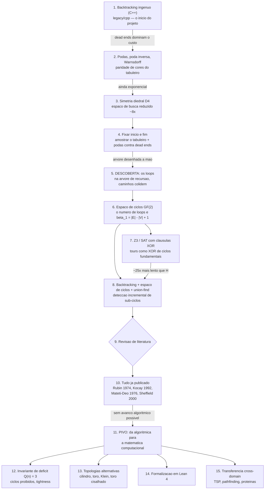

# KnightMove

Pesquisa sobre o **passeio do cavalo** (knight's tour): da tentativa de otimizar
o backtracking até a reformulação do problema no **espaço de ciclos sobre GF(2)**,
e daí para os invariantes topológicos que essa reformulação expõe.

O repositório é o registro completo dessa investigação — incluindo os resultados
negativos, que são a maioria e são apresentados como tal.

---

## Como a ideia evoluiu

O projeto não começou como pesquisa em topologia combinatória. Começou como
inconformismo com a ideia de que um problema clássico NP-difícil se resolvesse
"só com backtracking". Cada caixa abaixo é uma etapa real, na ordem em que aconteceu.



**Onde cada etapa mora no repositório**

| etapa | diretório |
|---|---|
| 1 | `legacy/cpp/` (no GitHub; origem do projeto) |
| 2 | `experiments/01_backtracking/` |
| 3 | `experiments/02_simetria_d4/` |
| 4 | `experiments/03_amostragem/` |
| 5–6 | `experiments/04_espaco_ciclos/` |
| 7 | `experiments/05_solvers_xor/` |
| 8 | `solvers/incremental_subtour/`, `solvers/knight_tours_optimized/` |
| 9–10 | `docs/prior-art.md` |
| 12 | `experiments/06_invariante_Q/` |
| 13 | `experiments/07_topologia/` |
| 14 | `formalization/lean/` |
| 15 | `experiments/09_cross_domain/` |

---

## O que é original e o que não é

Isso importa mais do que a lista de resultados. A auditoria completa, com
citações e trechos dos originais, está em `docs/prior-art.md`.

**Já existia na literatura** (redescoberto de forma independente aqui):

- o **algoritmo inteiro** — backtracking em variáveis-aresta + propagação de
  grau 2 + union-find de segmentos é o *multi-path method* de Rubin (1974),
  Christofides (1975) e Kocay (1992);
- o **XOR de ciclos** — é o *circuit vector space method* de Welch (1966) e
  Mateti–Deo (1976), e o **resultado negativo também já era teorema em 1976**:
  a razão tours/2-fatores tende a zero, logo enumerar por uniões de circuitos
  é desperdício assintótico;
- o **enquadramento** — `Ham(n) ⊆ Z_1` e seu deficit são o *Hamilton space*
  `C_n(G)` e sua codimensão; é área ativa (Heinig 2013, Hou–Yin 2025,
  Hefetz–Krivelevich 2025, Christoph–Nenadov–Petrova 2024);
- **`deficit > 0`** — Heinig observou que `delta(G) >= 3` é necessário para
  Hamilton-generation, e o cavalo tem cantos de grau 2. A *existência* da
  obstrução não é descoberta deste projeto;
- **tours em superfícies** — Watkins (2004), Forrest–Teehan (2015),
  Forrest–Lague (2024) já classificam tours por classe de homotopia no toro,
  cilindro, Möbius e Klein;
- flips por face = *Z-transformation*, Sheffield (2000); DPLL(XOR) é padrão.

**Contribuição própria, até onde a revisão alcançou:**

- o **valor exato** `deficit = 3` (não apenas `> 0`) e sua **constância em `n`**:
  o colapso `4 -> 3` via o núcleo do funcional soma é onde está a matemática;
- a **localidade**: `Q(G_T \ S) = 3 <=> W_corners ⊆ S`, `Q = max(0, k_deg2 - 1)`;
- a **conexidade do bulk** para `n >= 6` (indução `n -> n+2`);
- **tightness** provada por certificados auditados em 7 tabuleiros, incluindo o `6×8` **sem conhecer o conjunto de tours**;
- a formalização em **Lean 4** de `Q(n)=3` e `Q(n,m)=3`, sem `sorry`;
- **equidistribuição** por classe de homologia nas superfícies — a literatura
  responde *existência*, estas medições respondem *distribuição*, que é
  estritamente mais forte;
- a documentação sistemática dos **resultados negativos** e o diagnóstico de
  que conectividade não é linear sobre `F_2^E`.

**Reposicionamento.** A literatura de Hamilton space opera no regime denso /
pseudoaleatório, onde o deficit tipicamente é zero. O grafo do cavalo é
esparso (`|E| ≈ 4|V|`, grau mínimo 2). Lido assim, o resultado é *o primeiro
exemplo estruturado de deficit positivo, exato e constante numa família
esparsa natural, determinado por geometria local* — complementar à literatura,
não concorrente.

---

## Resultados principais

| tema | resultado | onde |
|---|---|---|
| solver mais rápido | backtracking + espaço de ciclos + union-find incremental: ~25x sobre Z3 no 10×10; custo por tour constante em `n ∈ {6..14}` | `solvers/incremental_subtour/` |
| teorema do deficit | `Q(n) = 3` provado para `n >= 6`; verificado em `n = 8` (rank 102) e `n = 12` (rank 294) | `experiments/06_invariante_Q/deficit_theorem/` |
| localidade de Q | `Q(G_T \ S) = 3 <=> W_corners ⊆ S`; `Q = max(0, k_deg2 - 1)` | `experiments/06_invariante_Q/Q_locality_theorem.py` |
| tightness | provada por certificados auditados, sem amostragem, em `n ∈ {6,8,10,12,14}` e nos retângulos `6×7`, `6×8`; reduzida no caso geral a um enunciado sobre `Z_bulk` | `experiments/06_invariante_Q/tightness_witnesses/` |
| pipeline GF(2) 10×10 | `V=100, E=288, beta_1=189`, rank 186, 8 arestas obrigatórias | `experiments/04_espaco_ciclos/board_10x10/` |
| ciclos proibidos | 3 ciclos proibidos no 6×6; detector dual mínimo de 2 termos | `experiments/04_espaco_ciclos/forbidden_cycles_6x6/` |
| topologia | plano `Q=3`, cilindro `Q=0`, toro `Q=0`. O deficit nulo no toro é corolário de Alspach–Locke–Witte (1990): o cavalo toroidal é um grafo de Cayley, e é a **transitividade por vértices** que mata o deficit, não a topologia | `experiments/07_topologia/` |
| Lean 4 | `Q(n)=3` e `Q(n,m)=3` formalizados sem `sorry` | `formalization/lean/` |
| estimador de contagem | `N(10) ≈ 2.4e22`, `N(12) ≈ 1.3e33` (estimador de Knuth) | `experiments/08_heuristicas/tour_count_estimator.py` |
| divide-and-conquer | catálogo de blocos 6×6 universal; 18×18 em 0.01s contra timeout de 60s do backtracking | `experiments/08_heuristicas/dnc_*.py` |

### Resultados negativos (documentados de propósito)

| hipótese | veredito | onde |
|---|---|---|
| cláusulas XOR aceleram o Z3 | speedup ≈ 1.00x | `experiments/05_solvers_xor/xor_clauses_benchmark/` |
| tabela de fase local `f∞` acelera a busca | speedup constante ~1.0; o ganho real vem da pressão de vértice | `experiments/08_heuristicas/local_phase_heuristic/` |
| LUT de patch XOR resgata sub-tours | taxa de resgate 0% em 16k casos | `experiments/08_heuristicas/investigate_patch.py` |
| XOR de ciclos enumera caminhos s→t | cobre 0,0086% dos caminhos no 6×6 | `experiments/09_cross_domain/path_decomposition_experiment/` |
| XOR em GF(2) ajuda em TSP / pathfinding | ~15% pior que 2-opt; falha dominante é desconexão (90,8%) | `experiments/09_cross_domain/tsp_cycle_space/`, `.../pathfinding_xor_experiment/` |
| método se aplica a sítios ativos de proteínas | inviável: soluções são k-cliques, não subgrafos pares (0 de 17.367 XORs válidos) | `experiments/09_cross_domain/protein_study/` |

O fio condutor dos negativos: **conectividade é a obstrução global**, e ela não
é capturada pelo espaço de ciclos sobre GF(2).

---

## Estrutura do repositório

```
KnightMove/
├── core/                  engines reutilizáveis (plano, toro, cilindro, Klein, cisalhado, D&C)
├── solvers/               solvers de produção: union-find incremental, otimizado, matriz de transferência
├── experiments/
│   ├── 01_backtracking/   primeiras engines, destruição de loops, correlações
│   ├── 02_simetria_d4/    redução por simetria diedral
│   ├── 03_amostragem/     amostragem massiva 8×8 (Fase A/B) e 10×10 (Fase C)
│   ├── 04_espaco_ciclos/  pipeline GF(2), exclusões de ordem superior, ciclos proibidos
│   ├── 05_solvers_xor/    Z3, AllSAT, cláusulas XOR, Yen vs XOR
│   ├── 06_invariante_Q/   teorema do deficit, localidade de Q, tightness, busca residual
│   ├── 07_topologia/      toro, cilindro, Klein, toro cisalhado, winding numbers
│   ├── 08_heuristicas/    fase local f∞, martingale, razão tours/2-fatores, D&C, estimador
│   └── 09_cross_domain/   TSP, pathfinding, decomposição de caminhos, proteínas
├── benchmarks/            comparações entre solvers
├── formalization/lean/    formalização em Lean 4
├── viz/                   geração de figuras e árvores de backtracking
├── data/                  resultados agregados + archives/ (amostras brutas, Git LFS)
├── docs/                  história, prior art, prompts de agente, relatórios, fonte da wiki
└── tests/                 testes de regressão
```

Cada diretório tem seu próprio `README.md` com o contexto específico.

---

## Começando

```bash
python -m venv venv && ./venv/bin/pip install -e ".[fast,analysis]"

# teste de regressão rápido: deve encontrar exatamente 9862 tours no 6x6
./venv/bin/python benchmarks/benchmark_exhaustive_6x6.py

# solver de referência
./venv/bin/python -m solvers.knight_tours_optimized.benchmark
```

Scripts em `experiments/` e `benchmarks/` que precisam das engines de `core/`
carregam um bootstrap de 5 linhas no topo do arquivo, que localiza a raiz do
repositório e insere `core/` no `sys.path`. Isso significa que podem ser
executados de qualquer diretório, sem `PYTHONPATH`.

## Dados

`data/archives/` guarda as amostras brutas das Fases A/B/C (2,4 GB de JSON
comprimidos para 66 MB) via **Git LFS**. `data/raw/` não é versionado: contém
saídas regeneráveis, incluindo o catálogo de destruição de 352 MB
(regenerável por `experiments/01_backtracking/cavalo_loop_destruicao_6x6.py`).

## Projetos relacionados

- **[knight-tour-visualizer](https://github.com/matheus-fsc/knight-tour-visualizer)** —
  frontend estático para inspecionar o grafo 8×8, a árvore geradora BFS, os ciclos
  fundamentais, as órbitas D4 e o XOR de ciclos em GF(2).
- **[Wiki](https://github.com/matheus-fsc/KnightMove/wiki)** — a narrativa completa
  em formato de leitura, com a teoria por trás de cada etapa.

## Estado atual

O paper corrente é `knight_tour_tightness` v5 (15/08/2026), e não fica neste
repositório — ver `docs/paper-status.md` para o que ele reivindica e
`docs/prior-art.md` para o que é e o que não é contribuição.

Em aberto, em ordem de importância:

1. **Conjectura de geração por hexágonos** — se os hexágonos certificados do
   bulk geram `Z_bulk(n)` para todo `n >= 8` par, a tightness vale em geral.
2. **O que governa o limiar** — `5×6` e `5×8` têm estrutura de cantos idêntica
   e deficit 27 e 9. A obstrução some ao alongar o tabuleiro, o que descarta
   explicação por gadget local. O fenômeno está delimitado, não entendido.
3. **A ponte Lean ↔ objeto combinatório** — a cadeia formalizada é a
   *equivalência*, não a tightness. Ver `docs/wiki-md/Formalizacao-Lean.md`.

Comentários e referências são muito bem-vindos via issues.
